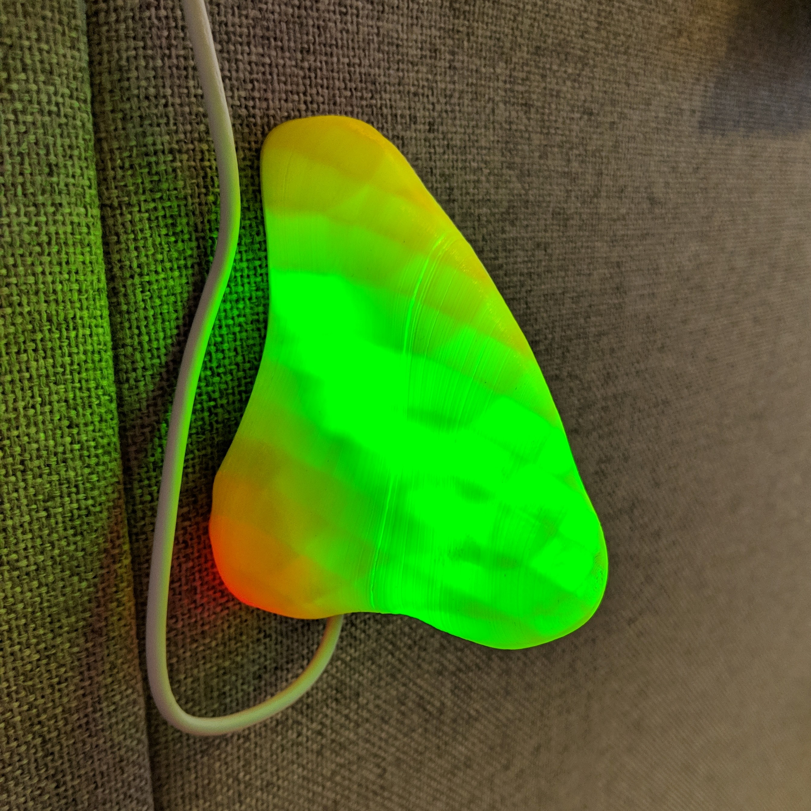
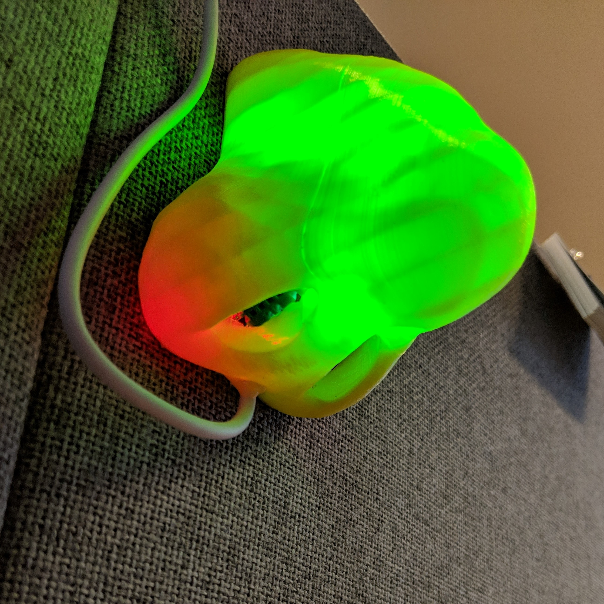

# N.O.S.E.
Low cost environmental sensor for office spaces
Sculpted from the finest examples around the world

The N.O.S.E. has light indicators to state the current CO2 (by the level of green, looking sick) or temperature (if the office is cold, it gets red). Also has a party mode.

|||
|---|---|

# Hardware
* CCS811 breakboard $9.50 USD https://www.aliexpress.com/item/CJMCU-811-CCS811-Carbon-Monoxide-CO-VOCs-Air-Quality-Numerical-Gas-Sensors/32762314271.html
* DHT11 sensor $0.91 USD https://www.ebay.com/itm/Sensitivity-Digital-DHT11-DHT-11-Temperature-and-Humidity-Sensor-For-Arduino/232382321233
* Wemos D1 ESP8266 $2.70 USD https://www.ebay.com/itm/New-Version-D1-Mini-NodeMCU-Lua-ESP8266-ESP12-WeMos-D1-Mini-WIFI-4M-Bytes-Module/372286616671
* WS2812 Led strip (5 pixels)

# Firmware
* LOLIN (WEMOS) D1 R2 & Mini ESP8266 board http://arduino.esp8266.com/stable/package_esp8266com_index.json
* Modded CCS811 library: https://github.com/eried/CCS811

# Software 
* ThingSpeak dashboard https://thingspeak.com/channels/692748

